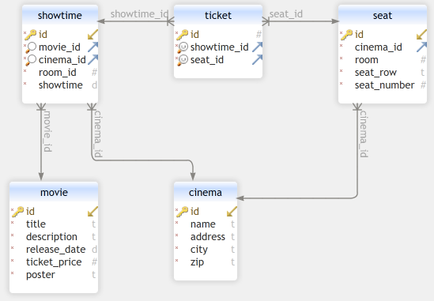

# Application
## Web App
Our web app is an online cinema ticket booking system. It allows users to search for movies, cinemas and sessions, and book tickets for the sessions they want.

The web app has one page that allows the user to choose the movie. From there, one that allows the choice of preferred cinema by address and the preferred showtime available in the chosen cinema.

Having the movie, cinema and showtime, the user can then proceed to a page that allows the choice of seats and snacks.

The user’s input will then go to a summary page that, after confirmation, makes a POST request to the backend that reserves the ticket in the database. 


## Frontend
### **index.html**
- Presents a list of all the available movies, each with its poster and description.

Makes a GET request to the database to get all the movies.

Constructs an html table in which each row has a movie which if selected goes to `/movie.html?movie_id=id`

The first cell of a row has the movies' poster. The second cell has its description.

### **movie.html**
- Gives the information of the selected movie and allows the client to choose their prefered cinema and from there the session the want to attend.

Makes a GET request to the database to get the movie information for the given `movie_id`, namely the poster and description.

Makes another GET request to the database to obtain all the cinemas that show the selected movie and displays them in a dropdown menu.

From that dropdown menu, the client can choose their prefered cinema. Once they do, another GET request is made to the database to obtain the sessions available for the selected pair of movie and cinema.

Each of the sessions that are displayed on the screen will redirect the client to the next page (`/seats.html?showtime_id=id`) with the selected session identified by `showtime_id`.

### **seats.html**
- Shows all the available seats in the selected session and allows the client to choose their prefered seats and choose the number of popcorn and drinks they want to order.

Makes GET requests to load the session and cinema choosen.

Creates a form containing all the seats. The seats information is filled out through a GET request to obtained all the seats available for the selected `showtime_id` wich are all placed in the form as `TAKEN` (marked as red).

Another GET request is made to get all the avilable seat of the session and those seats are changed to `AVAILABLE` (marked as black).

The total price of the purchase is shown and is updated as the client chooses seats or changes the number of popcorn or drinks they wish to order.

The input boxes that allow the client to change the number of drinks or popcorn are at the end of the page accompanied by a `buy` button that guides the client to the payment page where they can confirm their purchase.

While operating the page, if the client alters the number of drinks or popcorn, a function will be called to alter the price of the purchase.

And if the client chooses a seat, a function is called to update the seat - change it to `CHOOSEN` (marked as green), add it to the array of choosen seats and call the function to update the price.

### **pay.html**
- Shows the client all the information they have choosen so far so the client can confirm everything and pay for their ticket.

Makes GET requests to to load the session and cinema choosen.

Then loads the information gathered in the previous page regarding the food items, and loads the information regaring the seats, such as the row and number of the seat.

For this, there is another GET request for the information regarding each individual seat choosen.

At the end of the page a `PAY` button will make a POST request to the backend, which inserts the purchase tickets into the database.

By clicking the button, the client is redirected to a success page.

### **success.html**
- Thanks the client for their purchase.

This page allows the client to go back to the home page.


## Backend Endpoints
### GET /api/cinemas.php
- `cinema_id` [optional] Returns a single cinema

returns list of cinemas:
```json
[
    {
        "id":"1",
        "name":"NOS Alvalade",
        "address":"Av. Alvalade, 1",
        "city":"Lisboa",
        "zip":"1000-000"
    },
]
```

### GET /api/movie.php
- `movie_id` [optional] Returns a single movie

returns list of movies:
```json
[
    {
        "id":"1",
        "title":"Star Wars: A New Hope",
        "description":"Luke Skywalker ...",
        "release_date":"1977-05-25",
        "ticket_price":"10.00",
        "poster":"https:\/\/upload.wikimedia.org\/wikipedia\/en\/8\/87\/StarWarsMoviePoster1977.jpg"
    },
]
```

### GET /api/seat.php
- `seat_id` [optional] Returns a single seat
- `showtime_id` [optional] Returns seats for a single showtime
- `available=True` [optional] Returns only available seats

returns list of seats:
```json
[
    {
        "id":"1",
        "cinema_id":"1",
        "room":"1",
        "seat_row":"A",
        "seat_number":"1"
    },
]
```

### GET /api/showtime.php
- `showtime_id` [optional] Returns a single showtime
- `cinema_id` [optional] Returns showtimes for a single cinema
- `movie_id` [optional] Returns showtimes for a single movie
- `cinema_id` and `movie_id` [optional] Returns showtimes for a single cinema and movie

returns list of shotimes:
```json
[
    {
        "id":"1",
        "movie_id":"1",
        "cinema_id":"1",
        "room_id":"1",
        "showtime":"2025-01-01 10:00:00"
    },
]
```

### GET /api/ticket.php
- `ticket_id` [optional] Returns a single ticket
- `showtime_id` [optional] Returns tickets for a single showtime

```json
[
    {
        "id":"1",
        "showtime_id":"1",
        "seat_id":"1"
    },
]
```

### POST /api/ticket.php
- `showtime_id` [required] Showtime ID
- `seat_id` [required] Seat ID

returns nothing if successful or error message if not

## Database

