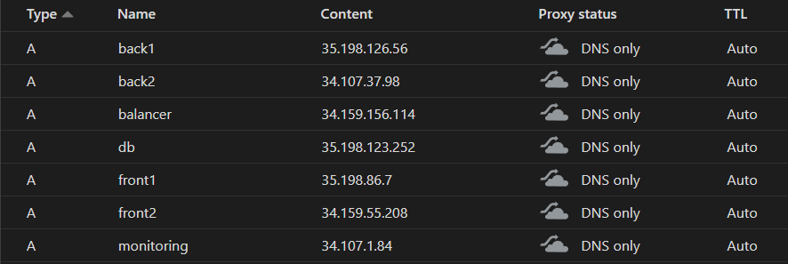

# Infrastructure

To facilitate the testing of the app we created DNS records pointing to the load balancer. The records are:

## Terraform

### Networks
One firewall rule is created for the load balancer to allow incoming TCP connections to ports 80(HTTP) and 443(HTTPS).
Since the machines only communicate between them through the local network, there is no need to apply firewall rules, only for external connections to the balancer (reverse proxy) machine.
By default ICMP and SSH connections are already allowed.

### Servers
Multiple servers are created by terraform:

- Multiple frontend servers can be created, at the moment there are only 2

- Multiple backend servers can be created, at the moment there are only 2

- 1 Load Balancer is created

- 1 Database is created

- 1 Monitoring is created

Blue arrows represent application communication while green arrows represent monitoring communication.

After the servers are created, their public IPs are registered at Cloudflare.
The machine's IPs are also inserted into the Ansible hosts file to allow automatic provisioning.

After Terraform has finished, Ansible can run to provision the VMs.
