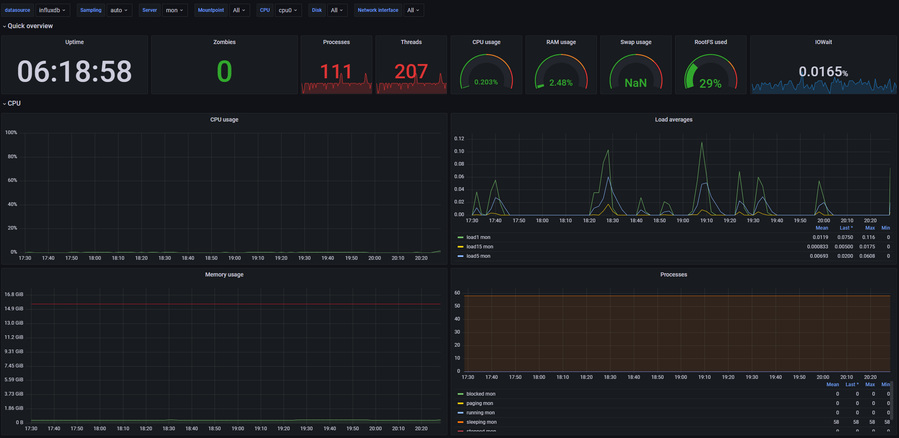
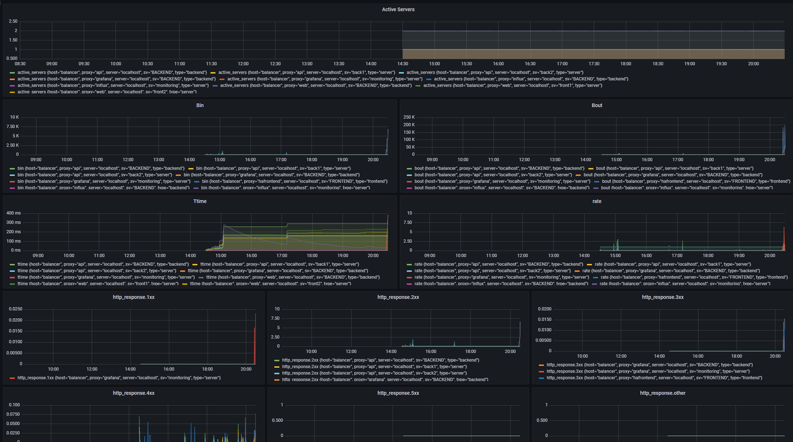
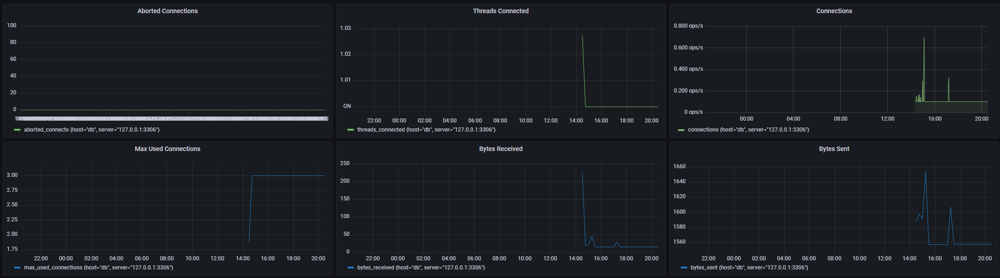
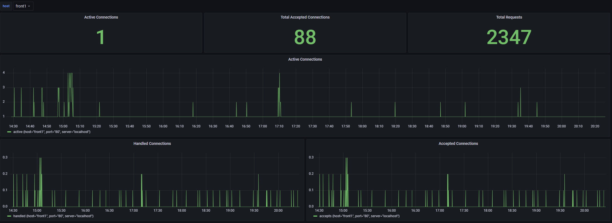

# Ansible
Ansible installs the required packages, configures the web app and database, configures the load balancer and installs the monitoring machine.

## Targets
On all targets we installed the InfluxDB repo signing key so we could install Telegraf.
Telegraf is used to feed metrics from the hosts into InfluxDB.

## Database
On the database machine we installed mysql.
We also created credentials and imported a database for our application.

## Frontend Servers
We installed Nginx to serve the application and copied a default configuration onto it.

## Backend Servers
The backend Servers share the same installation steps as the frontend servers.
And then we installed PHP to serve the requests.

## Load Balancer
On the load balancer, we installed HAproxy.
HAproxy will forward the requests onto every machine.
HAproxy will forward:

- grafana.team-13.pt -> monitoring:3000

- influx.team-13.pt -> monitoring:8086

- /api -> backend web servers (roundrobin)

- \* -> frontend web servers (roundrobin)

## Monitoring
On the monitoring machine, we installed InfluxDB and Grafana.
InfluxDB is configured with a user, password, default bucket and token.
For grafana we changed the default user's password, added InfluxDB as datasource and imported all the dashboards.

# Monitoring

## InfluxDB
InfluxDB is used to store the metrics collected by Telegraf.
InfluxDB is accessible at [influx.team-13.pt](http://influx.team-13.pt).

## Grafana
Grafana is used to display the metrics stored in InfluxDB.
Grafana is accessible at [grafana.team-13.pt](http://grafana.team-13.pt).

**System Dashboard:**

**HAProxy Dashboard:**

**MySQL Dashboard:**

**Nginx Dashboard:**

