# Project Report

[Project video](https://www.youtube.com/watch?v=VCaEU6hwSHM)

Team-13 members:
| Student Number | Name                  |
|----------------|-----------------------|
|93734           |Maria Beatriz Venceslau|
|94230           |Samuel Barata          |
|96765           |Sandra Castilho        |

## Introduction
The goal of this project is to deploy and provision a tiered Microservices-based containerized Web Application on a Public Cloud provider, in our case Google Cloud Platform. 

For this we used automation tools, such as Terraform and Ansible.
We also implemented instrumentation on the applications, services, and infrastructure components of the solution, to allow monitoring and logging features by using InfluxDB and Grafana. 

## Application
### Web App
Our web app is an online cinema ticket booking system. It allows users to search for movies, cinemas and sessions, and book tickets for the sessions they want.

The web app has one page that allows the user to choose the movie. From there, one that allows the choice of preferred cinema by address and the preferred showtime available in the chosen cinema.

Having the movie, cinema and showtime, the user can then proceed to a page that allows the choice of seats and snacks.

The user’s input will then go to a summary page that, after confirmation, makes a POST request to the backend that reserves the ticket in the database. 

<!-- The documentation is available at the [Application README.md](Application/README.md). -->

### Frontend
#### **index.html**
- Presents a list of all the available movies, each with its poster and description.

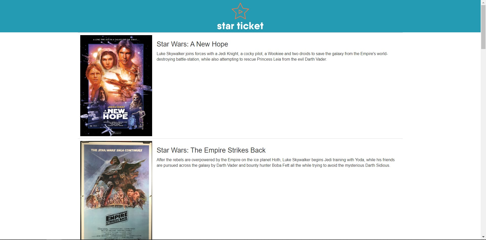

Makes a GET request to the database to get all the movies.

Constructs an html table in which each row has a movie which if selected goes to `/movie.html?movie_id=id`

The first cell of a row has the movies' poster. The second cell has its description.

#### **movie.html**
- Gives the information of the selected movie and allows the client to choose their prefered cinema and from there the session the want to attend.

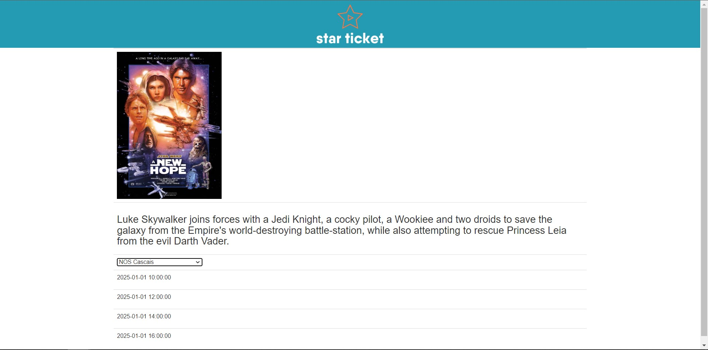

Makes a GET request to the database to get the movie information for the given `movie_id`, namely the poster and description.

Makes another GET request to the database to obtain all the cinemas that show the selected movie and displays them in a dropdown menu.

From that dropdown menu, the client can choose their prefered cinema. Once they do, another GET request is made to the database to obtain the sessions available for the selected pair of movie and cinema.

Each of the sessions that are displayed on the screen will redirect the client to the next page (`/seats.html?showtime_id=id`) with the selected session identified by `showtime_id`.

#### **seats.html**
- Shows all the available seats in the selected session and allows the client to choose their prefered seats and choose the number of popcorn and drinks they want to order.

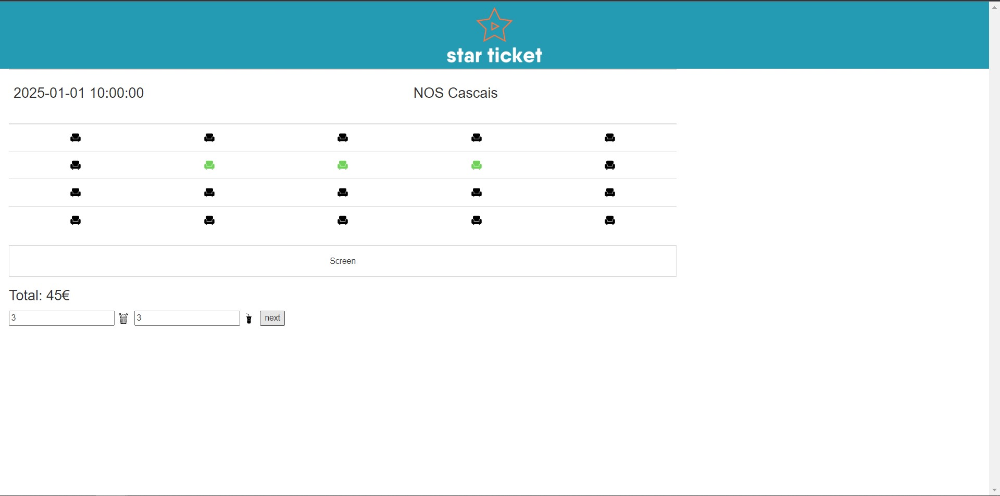

Makes GET requests to load the session and cinema choosen.

Creates a form containing all the seats. The seats information is filled out through a GET request to obtained all the seats available for the selected `showtime_id` wich are all placed in the form as `TAKEN` (marked as red).

Another GET request is made to get all the avilable seat of the session and those seats are changed to `AVAILABLE` (marked as black).

The total price of the purchase is shown and is updated as the client chooses seats or changes the number of popcorn or drinks they wish to order.

The input boxes that allow the client to change the number of drinks or popcorn are at the end of the page accompanied by a `buy` button that guides the client to the payment page where they can confirm their purchase.

While operating the page, if the client alters the number of drinks or popcorn, a function will be called to alter the price of the purchase.

And if the client chooses a seat, a function is called to update the seat - change it to `CHOOSEN` (marked as green), add it to the array of choosen seats and call the function to update the price.

#### **pay.html**
- Shows the client all the information they have choosen so far so the client can confirm everything and pay for their ticket.

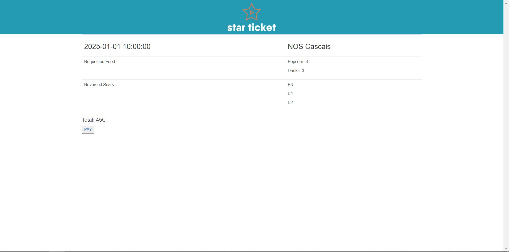

Makes GET requests to to load the session and cinema choosen.

Then loads the information gathered in the previous page regarding the food items, and loads the information regaring the seats, such as the row and number of the seat.

For this, there is another GET request for the information regarding each individual seat choosen.

At the end of the page a `PAY` button will make a POST request to the backend, which inserts the purchase tickets into the database.

By clicking the button, the client is redirected to a success page.

#### **success.html**
- Thanks the client for their purchase.

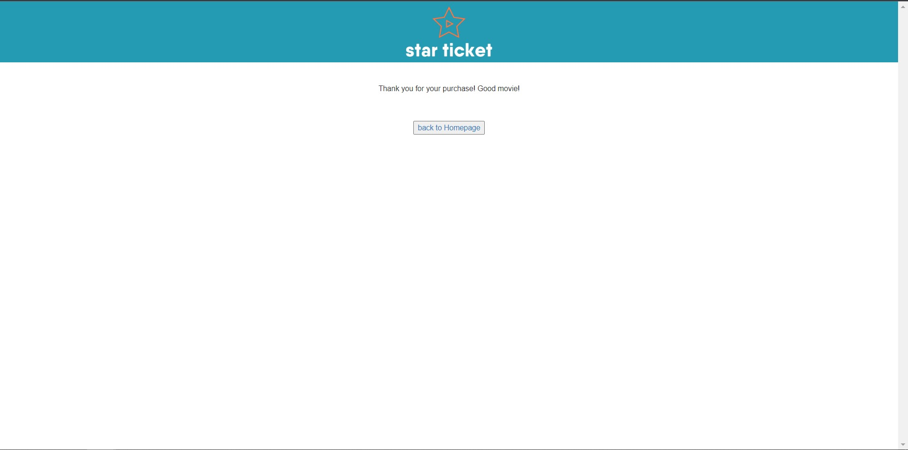

This page allows the client to go back to the home page.


### Backend Endpoints
#### GET /api/cinemas.php
- `cinema_id` [optional] Returns a single cinema

returns list of cinemas:
```json
[
    {
        "id":"1",
        "name":"NOS Alvalade",
        "address":"Av. Alvalade, 1",
        "city":"Lisboa",
        "zip":"1000-000"
    },
]
```

#### GET /api/movie.php
- `movie_id` [optional] Returns a single movie

returns list of movies:
```json
[
    {
        "id":"1",
        "title":"Star Wars: A New Hope",
        "description":"Luke Skywalker ...",
        "release_date":"1977-05-25",
        "ticket_price":"10.00",
        "poster":"https:\/\/upload.wikimedia.org\/wikipedia\/en\/8\/87\/StarWarsMoviePoster1977.jpg"
    },
]
```

#### GET /api/seat.php
- `seat_id` [optional] Returns a single seat
- `showtime_id` [optional] Returns seats for a single showtime
- `available=True` [optional] Returns only available seats

returns list of seats:
```json
[
    {
        "id":"1",
        "cinema_id":"1",
        "room":"1",
        "seat_row":"A",
        "seat_number":"1"
    },
]
```

#### GET /api/showtime.php
- `showtime_id` [optional] Returns a single showtime
- `cinema_id` [optional] Returns showtimes for a single cinema
- `movie_id` [optional] Returns showtimes for a single movie
- `cinema_id` and `movie_id` [optional] Returns showtimes for a single cinema and movie

returns list of shotimes:
```json
[
    {
        "id":"1",
        "movie_id":"1",
        "cinema_id":"1",
        "room_id":"1",
        "showtime":"2025-01-01 10:00:00"
    },
]
```

#### GET /api/ticket.php
- `ticket_id` [optional] Returns a single ticket
- `showtime_id` [optional] Returns tickets for a single showtime

```json
[
    {
        "id":"1",
        "showtime_id":"1",
        "seat_id":"1"
    },
]
```

#### POST /api/ticket.php
- `showtime_id` [required] Showtime ID
- `seat_id` [required] Seat ID

returns nothing if successful or error message if not

### Database


## Deployment
Regarding the deployment, we considered using VmCloud or GCP, since we already had Terraform files from the lab to use as base. We ended up using GCP because of quota limitations with VmCloud.
Our web app is available at [team-13.pt](http://team-13.pt).

We decided to have server replication, so we implemented a load-balancer using roundrobin algorithm. We merged this functionality with our proxy. 

For our database, we used MySQL. This database is deployed in a Virtual Machine of our own and not Google’s built-in engine. This decision was made so that it would be uniform with the rest of the project. It would also be a simpler deployment and an easier process if there was a need for any alterations. 

For the development of our frontend, we chose to use HTML with JavaScript and CSS. Even though it is a web app without many visual additions and not a lot of dynamism, we judged it was enough in the context of this class to be able to deploy the pages in a simpler way. 

For the backend, we used PHP given that it can make simple requests to the database and allows for good integration with the HTTP protocol services. As such, we thought it would be the most suitable choice for the development of our backend services. 

Both Frontend and Backend content is served by Nginx.

## Infrastructure

To facilitate the testing of the app we created DNS records pointing to the load balancer. The records are:

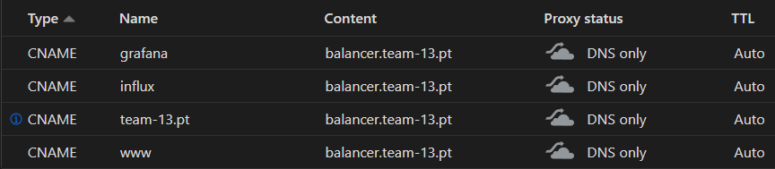

### Terraform

#### Networks
One firewall rule is created for the load balancer to allow incoming TCP connections to ports 80(HTTP) and 443(HTTPS).
Since the machines only communicate between them through the local network, there is no need to apply firewall rules, only for external connections to the balancer (reverse proxy) machine.
By default ICMP and SSH connections are already allowed.

#### Servers
Multiple servers are created by terraform:

- Multiple frontend servers can be created, at the moment there are only 2

- Multiple backend servers can be created, at the moment there are only 2

- 1 Load Balancer is created

- 1 Database is created

- 1 Monitoring is created

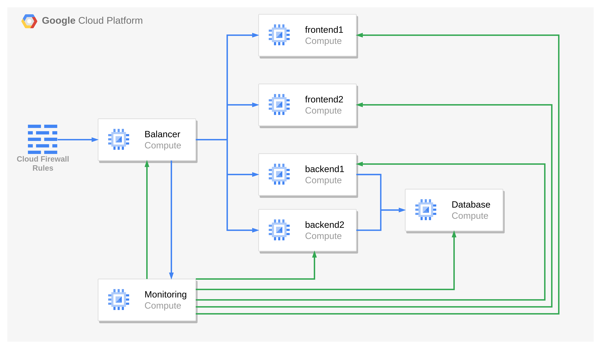

Blue arrows represent application communication while green arrows represent monitoring communication.

After the servers are created, their public IPs are registered at Cloudflare.
The machine's IPs are also inserted into the Ansible hosts file to allow automatic provisioning.

<!--More details at [Infrastructure/README.md](Infrastructure/README.md).-->


After Terraform has finished, Ansible can run to provision the VMs.

### Ansible
Ansible installs the required packages, configures the web app and database, configures the load balancer and installs the monitoring machine.

<!-- More details at [Provisioner/README.md](Provisioner/README.md). -->

#### Targets
On all targets we installed the InfluxDB repo signing key so we could install Telegraf.
Telegraf is used to feed metrics from the hosts into InfluxDB.

#### Database
On the database machine we installed mysql.
We also created credentials and imported a database for our application.

#### Frontend Servers
We installed Nginx to serve the application and copied a default configuration onto it.

#### Backend Servers
The backend Servers share the same installation steps as the frontend servers.
And then we installed PHP to serve the requests.

#### Load Balancer
On the load balancer, we installed HAproxy.
HAproxy will forward the requests onto every machine.
HAproxy will forward:

- grafana.team-13.pt -> monitoring:3000

- influx.team-13.pt -> monitoring:8086

- /api -> backend web servers (roundrobin)

- \* -> frontend web servers (roundrobin)

#### Monitoring
On the monitoring machine, we installed InfluxDB and Grafana.
InfluxDB is configured with a user, password, default bucket and token.
For grafana we changed the default user's password, added InfluxDB as datasource and imported all the dashboards.

## Monitoring

### InfluxDB
InfluxDB is used to store the metrics collected by Telegraf.
InfluxDB is accessible at [influx.team-13.pt](http://influx.team-13.pt).

### Grafana
Grafana is used to display the metrics stored in InfluxDB.
Grafana is accessible at [grafana.team-13.pt](http://grafana.team-13.pt).

**System Dashboard:**

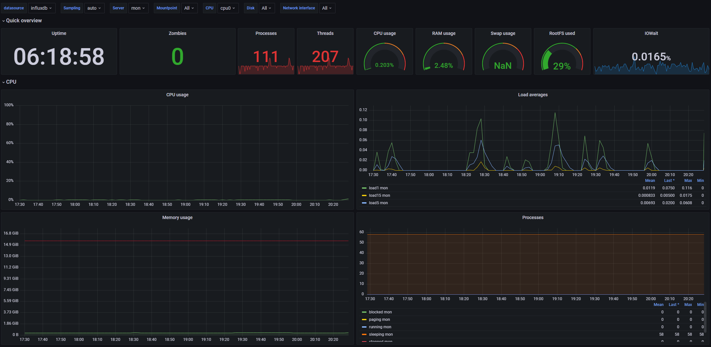

**HAProxy Dashboard:**

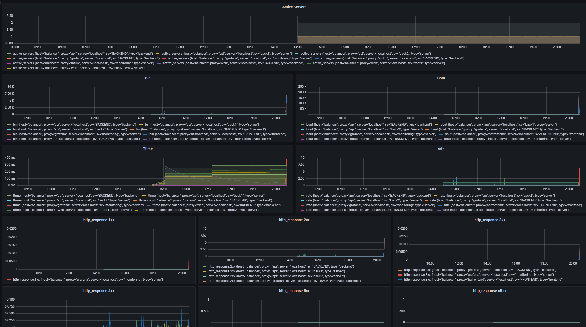

**MySQL Dashboard:**

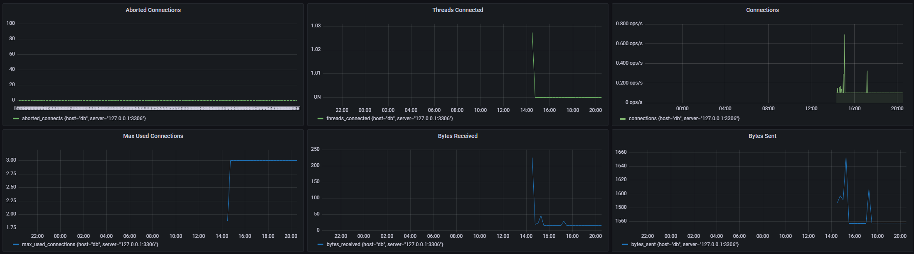

**Nginx Dashboard:**

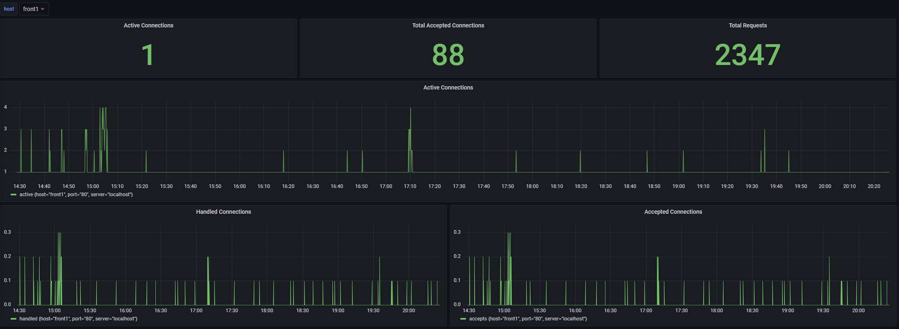

## CI/CD
We use Gitlab CI to deploy our application. The CI pipeline is defined in .gitlab-ci.yml. The pipeline has 4 stages: Linting, Spin Up, Provisioning, and Destroy.

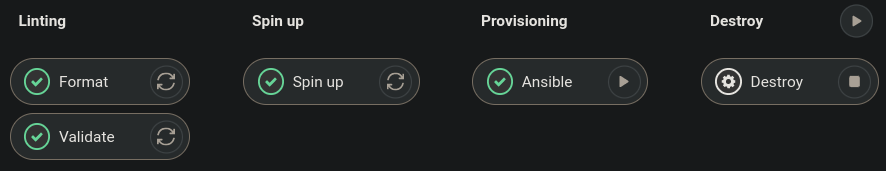

- **Linting** stage will test the terraform files for syntax and formatting errors. If this stage fails the rest of the pipeline won't be allowed to run;

- **Spin Up** stage will create the infrastructure using terraform, if this stage fails the pipeline will destroy the created resources;

- **Provisioning** stage will provision the VMs using the playbook in the Provisioner folder. This stage is delayed 60 seconds to allow the VMs to finish booting. This stage is allowed to fail and can be run multiple times.

- **Destroy** stage will destroy the infrastructure created by Terraform. This stage is manual.

The pipeline is run in a docker container with the image [samuelbarata/agi-cicd](https://hub.docker.com/r/samuelbarata/agi-cicd).
This container is based on the bootstrap-mgmt-docker script (bootstrap-mgmt-docker.sh) from the course.

## Summary
Overall, the project went smoothly. We misjudged how long it would take to create our own app instead of using an open-source one.
There were more features we planned on adding, but we didn’t have time because of the time we spent developing the application.

We intended on also deploying the webapp with https and creating a Grafana dashboard with Application statistics, such as room occupancy statistics and number of drinks and popcorn purchased.

Given that we were working on a private repo and for the sake of simplicity, the private keys and passwords for this project are stored in the repo, altough this is a security risk. Properly done, the sensible information would be stored as secrets in the repo, [as we did in the pipeline](https://git.rnl.tecnico.ulisboa.pt/AGISIT-22-23/team-13/src/commit/7e7f205a1a870a3fe169bc8f96d64944b8d8cf1e/project/.gitlab-ci.yml#L54).

## Setup Instructions
Requirements to run the project:
- Generetaded SSH key pair
- Management "machine" with docker image [samuelbarata/agi-cicd](https://hub.docker.com/r/samuelbarata/agi-cicd)

There are 2 limitations while running this project:
- There can't be 2 instances running in the same project at the same time because machine names are hardcoded
- In Infrastructure/terraform-gcp-variables.tf, variables `zone_id` and `domain` are hardcoded for Cloudflare provisioner for the DNS records. Either alter this values or remove the `cloudflare_record` resources from Infrastructure/terraform-gcp-server.tf
> If you opt remove the `cloudflare_record` resources, you will have to apply the `frontend` firewall rules to the Monitoring server directly or change haproxy frontend config for the ACLs of Grafana and InfluxDB

### Deploy

Inside the management machine, run the following commands:
```bash
git clone # REPO_URL
cd team-13/project/Infrastructure
# make sure a private key exists in this folder with the name "id_rsa"
terraform init
terraform apply
# wait arround 60 seconds before running ansible
cd ../Provisioner
# make sure the same private key exists in this folder with the name "private_key"
# alternatively, you can change the private_key path in the ansible.cfg file
ansible-playbook setup-all.yml
```

### Destroy

To Destroy the infrastructure run the following commands:
```bash
cd team-13/project/Infrastructure
# make sure a private key exists in this folder with the name "id_rsa"
# make sure that tfstate file from terraform apply is present
terraform destroy
```
